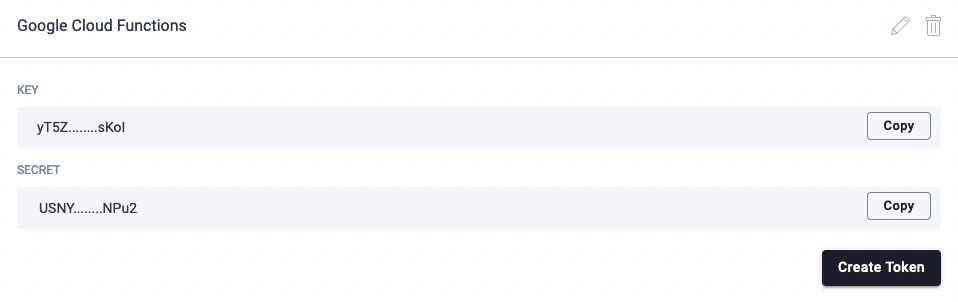
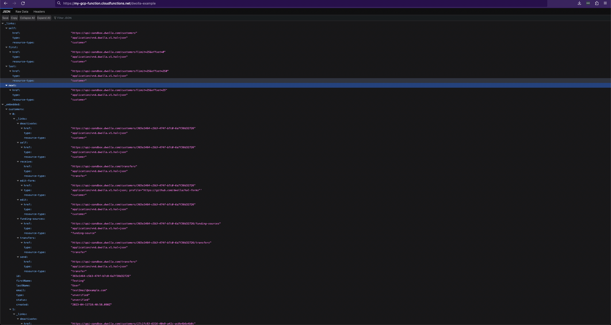

# Dwolla Google Cloud Functions Example

This small example shows how you can use the Dwolla SDK with Google Cloud Functions.

## Table of Contents

* [Prerequisites](#prerequisites)
* [Getting Started](#getting-started)
    * [Cloning Repository](#cloning-repository)
    * [Updating Environment Variables](#updating-environment-variables)
* [Google Cloud CLI](#google-cloud-cli)
    * [Authenticating](#authenticating)
    * [Deploying Function](#deploying-function)
    * [Visiting HTTP Server](#visiting-http-server)
* [Considerations](#considerations)

## Prerequisites

* [Dwolla Sandbox Account](https://accounts-sandbox.dwolla.com)
* [Google Cloud CLI](https://cloud.google.com/sdk/gcloud)

## Getting Started

### Cloning Repository

To deploy this repository to your Google Cloud account, this repository must be cloned to a local machine.

```shell
$ git clone git@github.com:Dwolla/google-cloud-functions-example.git
```

### Updating Environment Variables

Once this repository has been cloned, rename `.env.example.yaml` to `.env.yaml` and edit its contents to match the API
key and secret that is found on your Dwolla Sandbox or Production dashboard.



Given the application key and secret from the image above, your new `.env.yaml` should be similar to the following:

```yaml
DWOLLA_API_ENVIRONMENT: sandbox
DWOLLA_API_KEY: yT5Z........sKoI
DWOLLA_API_SECRET: USNY........NPu2
```

For more information about using environment variables in Google Cloud, please check out [_Using Environment
Variables_](https://cloud.google.com/functions/docs/configuring/env-var).

## Google Cloud CLI

### Authenticating

Before we can deploy our function to Google Cloud, the `gcloud` CLI will require authentication first. Additionally,
we'll also need to [provide our project ID](https://support.google.com/googleapi/answer/7014113?hl=en).

```shell
$ gcloud auth login
$ gcloud config set project $PROJECTNAME
```

### Deploying Function

To deploy our function to Google Cloud, execute the following command:

```shell
$ gcloud functions deploy dwolla-example \
  --allow-unauthenticated \
  --entry-point fetchCustomers \
  --env-vars-file .env.yaml \
  --runtime nodejs18 \
  --trigger-http
```

You should see a success message similar to the following in your console/terminal window:

```
Deploying function (may take a while - up to 2 minutes)...done.                                                                                      
...
httpsTrigger:
  securityLevel: SECURE_OPTIONAL
  url: https://my-gcp-function.cloudfunctions.net/dwolla-example
...
```

### Visiting HTTP Server

Based on the output from the [Deploying Function](#deploying-function) section above, you should be able to visit the
URL in your browser or via the command line using a tool like `curl`.



## Considerations

This example uses Google Cloud's built-in environment variable support for ease of use; however, in a production
environment it is recommended to make use of [Secret Manager](https://cloud.google.com/secret-manager) instead.